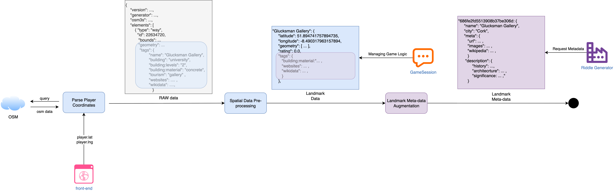

# scavenger.LandmarkProcessor

## Module Objective



This module provides end-to-end processing of urban Points of Interest (POIs) for use in an LLM-assisted landmark exploration and riddle-generation system. It is divided into two independent submodules with clearly defined responsibilities:

### Dependencies

- **OpenStreetMap (OSM) and Overpass API**: Used for extracting geospatial Points of Interest (POI) data.
- **MongoDB**: Used for storing processed landmark data.
- **Java SpringBoot**: Used for receiving and processing requests from the frontend.
- **Flask**: Used for handling requests in Python microservices.
- **Nominatim**: Used for reverse geocoding.
- **Wikipedia API**: Used for retrieving textual information about landmarks.
- **GPT-4 or other local models**: Used for processing and summarizing data obtained from external sources.
- **Python Libraries**:
  - `requests`: Used for HTTP requests.
  - `pymongo`: Used for interacting with MongoDB.
  - `flask`: Used for building Python microservices.

### Environment Configuration

This module uses environment variables to configure its connection to external services. The following variables should be defined in a `.env` file at the root of the project:

- `MONGO_URL`: The URL for connecting to the MongoDB instance. Default is `mongodb://localhost:27017`.
- `MONGO_DB`: The name of the MongoDB database to use. Default is `scavengerhunt`.
- `OPENAI_API_KEY`: The API key for accessing OpenAI services. This should be set to your actual OpenAI API key.

To set up the environment, create a `.env` file in the root directory of the project and add the above variables with your specific values. The application will automatically load these configurations at runtime.

### API Endpoints

The module does not directly expose any API endpoints. However, it interacts with several external APIs and services:

- **Overpass API**: Used to query OpenStreetMap for geospatial data.
- **Wikipedia API**: Accessed to retrieve textual information about landmarks.
- **OpenAI API**: Utilized for processing and summarizing data using LLMs.

### Troubleshooting

- **Environment Variables Not Loaded**: Ensure that the `.env` file is correctly placed in the root directory and contains all necessary variables. Use `load_dotenv()` to load these variables at runtime.
- **API Key Issues**: Verify that the `OPENAI_API_KEY` is correctly set in the environment variables. If the key is missing or incorrect, the module will not be able to access OpenAI services.
- **Database Connection Errors**: Check the `MONGO_URL` and `MONGO_DB` environment variables to ensure they point to the correct MongoDB instance and database. Ensure MongoDB is running and accessible.
- **HTTP Request Failures**: If requests to external APIs fail, check network connectivity and ensure the API endpoints are correct and accessible.
---

## Dev Log
### June. 15, 2025
#### Landmark Preprocessor

**Purpose:**
Extracts and filters geospatial POI data from OpenStreetMap (OSM) using Overpass API. It computes location centroids and stores clean landmark entries in MongoDB.

**Key Features:**

* Query-based extraction of candidate landmarks from OSM (e.g., buildings, galleries, parks)

* Filters out non-relevant categories (e.g., parking lots)

* Computes centroid coordinates from polygon geometries

* Normalizes and structures the result into:

  ```json
  {
    "name": "Boole Library",
    "latitude": 51.89,
    "longitude": -8.49,
    "tags": { ... }
  }
  ```

* Writes directly to the `landmarks` collection in MongoDB for use by the game backend


#### Landmark Metadata Generator

**Purpose:**
Enriches raw landmarks with structured semantic metadata by retrieving supplementary content from external sources and summarizing them using LLMs.

**Key Features:**

* Attempts to locate open textual information for each landmark:

  * Wikipedia summaries
  * Official institutional descriptions
  * Cultural and architectural context

* Uses LLMs (e.g., GPT-4 or local models) to process and summarize the retrieved data

* Produces structured metadata fields for each landmark:

  ```json
  {
    "landmarkId": "abc123",
    "metadata": {
      "history": "...",
      "architecture": "...",
      "functions": "...",
      "keywords": ["library", "UCC", "modernism"]
    }
  }
  ```

* Stores results into a new `landmark_metadata` collection or as an embedded `meta` field in the `landmarks` collection

---

### Aug. 7, 2025
#### Live Integration with Game Backend

**Purpose:**
Automatically initializes city-specific landmark data for any given GPS coordinate at runtime, ensuring data completeness and backend compatibility.

**Workflow:**

* A Java SpringBoot controller receives lat/lng via `/api/game/init-game`
* It delegates to `GameDataRepository.initLandmarkDataFromPosition(lat, lng)`, which sends a POST request to Flask endpoint `/fetch-landmark`
* The Flask service performs reverse geocoding via Nominatim to resolve the city
* It checks if landmarks for that city already exist in MongoDB. If the number of entries is above a defined threshold (e.g., 20), it skips fetching
* Otherwise, it triggers a full Overpass query + landmark extraction + MongoDB insert
* Only after completion does it return the resolved city name back to the Java backend, allowing the game controller to proceed safely

**Advantages:**

* Ensures consistent runtime support for any playable city
* Avoids redundant fetches by checking existing entry counts
* Eliminates race conditions or partial data loads through strict blocking behavior


#### Backend-triggered Landmark Initialization via Flask

A synchronous cross-service pipeline has been implemented:

1. Java backend receives coordinates from front-end client
2. Coordinates are sent to Python microservice (`/fetch-landmark`)
3. Python service:

   * Reverse geocodes location into city name
   * Checks if landmark data is already populated
   * If not, uses `LandmarkPreprocessor` to pull fresh data from OSM
   * Saves cleaned data to MongoDB
4. City name is returned only after MongoDB writes complete, ensuring consistency

This enables per-location initialization of any city without pre-loading the database manually.


#### Retrieval Layer - Wikipedia and Fallback Search

* For each landmark in the `landmarks` collection, the module attempts to fetch a Wikipedia page via `wikipedia.page()` using `auto_suggest=True`
* Handles disambiguation errors and page absence with fallback search via `wikipedia.search()` and a re-ranking loop
* All retrieved content is passed through a GPT-based semantic verification step

```python
def _aiInspection(landmark_name, city, wiki_text):
    prompt = f"""
    You are verifying if a Wikipedia article is about a specific landmark.
    Target Landmark: "{landmark_name}"
    City: "{city}"
    Text:
    \"\"\"
    {wiki_text}
    \"\"\"
    If this page is clearly about the target landmark, respond with only: `true`. Otherwise, respond with `false`.
    """
    # Submit to GPT (gpt-4, temperature=0.2)
    return gpt_response.strip().lower().startswith("true")
```

* Entries failing verification are excluded from downstream processing


#### Visual Context - Image Support for LLM Reasoning

* Extracts the top 5 `.jpg`, `.jpeg`, or `.png` image URLs from the Wikipedia page
* These image links are embedded into a `gpt-4-turbo` prompt using OpenAI's vision input format
* Visual data assists GPT in architectural or contextual reasoning


#### Generation Layer - LLM-Based Structured Summarization

* GPT receives a prompt asking for structured metadata including:

  * `history`: 5-10 keywords
  * `architecture`: 5-10 keywords
  * `functions`: 5-10 keywords

* The result is expected in strict JSON format

* If GPT indicates uncertainty, the result is discarded and recorded with a fallback marker


#### Output Format - Unified Metadata Schema

All processed metadata is written to the `landmark_metadata` collection in MongoDB:

```json
{
  "landmarkId": "<_id>",
  "name": "Boole Library",
  "city": "Cork",
  "meta": {
    "url": "...",
    "images": [...],
    "wikipedia": "...",
    "description": {
      "history": [...],
      "architecture": [...],
      "functions": [...]
    }
  }
}
```

#### Design Notes: Retrieval-Augmented Generation (RAG)

This module implements a lightweight RAG pipeline with the following stages:

* **Retrieve**: External information (Wikipedia page + image URLs)
* **Verify**: GPT-based semantic alignment check
* **Generate**: Vision-enabled GPT-based summarization

Benefits:

* Higher-quality semantic metadata
* Traceability and debuggability of source data
* A reusable structure suitable for adaptive riddle generation

Next Steps:

* Integrate `landmark_metadata` into the Java-side `PuzzleManager` as the primary input for riddle generation
* Use `description` fields to support difficulty estimation or thematic puzzle selection
* Add caching or retry logic for GPT requests to reduce cost and prevent data loss
* Extend support for multilingual metadata output
* Introduce a scheduler to backfill metadata for any newly inserted landmarks on demand


#### Critical Issues to Address

* **Duplicate Landmark Prevention**: The system currently performs multiple scans of the same target, causing database duplicates. Implement duplicate detection logic based on landmark name and city before inserting new entries to avoid redundant data storage.

* **Geographic Region Matching**: Address city name mismatches where reverse geocoding returns district names (e.g., "天河区") that don't match with broader city names in the database (e.g., "广州市"). Implement a hierarchical location mapping system to normalize district-level results to their parent city for consistent database queries.


#### Aug. 12, 2025 - Landmark Metadata API Integration & Duplication Handling

**Summary:**  
Completed end-to-end integration of the Landmark Metadata generation pipeline with the Java backend, ensuring on-demand enrichment of landmarks before gameplay.

**Details:**

1. **Java → Python Metadata Flow**
   * Implemented batch invocation of the Flask `/generate-landmark-meta` endpoint in `LandmarkManager.ensureLandmarkMeta()`.
   * Java sends a list of landmark IDs filtered by the current search radius.
   * Python checks the `landmark_metadata` collection for existing entries and only generates metadata for missing IDs.

2. **Python Endpoint Enhancements**
   * Fixed collection name mismatch, standardizing all reads/writes to `landmark_metadata`.
   * Updated `loadLandmarksFromDB()` to perform `ObjectId` conversion for precise `_id` matching in the `landmarks` collection.
   * Added filtering for empty or invalid IDs to prevent 500 errors.

3. **End-to-End Validation**
   * Tested with two Cork city landmarks: `6895327b04e4917e0d875698` and `6895327b04e4917e0d875697`.
   * Successfully triggered Wikipedia + GPT processing and wrote results to the `landmark_metadata` collection.
   * Created a Bash script to batch-delete meta records for given `landmarkId`s to facilitate repeatable testing.

4. **Current Impact**
   * All new landmarks are enriched with metadata automatically before the first puzzle is generated.
   * Landmarks with existing metadata are skipped, reducing API calls and costs.
   * Structured metadata is now ready to be consumed by `PuzzleAgent` for context-aware riddle generation.


#### Oct. 8, 2025 - Metadata Deduplication and Schema Refinement

**Summary:**  
Resolved critical data duplication issues in the `landmark_metadata` collection and refined the LLM summarization schema to better align with riddle generation requirements.

**Problem Context:**  
During production runtime, duplicate `landmark_metadata` entries were discovered for the same `landmarkId`, with the first entry often lacking a complete `description` field. This caused the PuzzleAgent to retrieve incomplete metadata, leading to degraded riddle quality.

**Root Cause Analysis:**
1. **No Database-Level Constraint**: The `landmark_metadata` collection lacked a unique index on `landmarkId`, allowing multiple inserts for the same landmark.
2. **Insert-Only Logic**: The original `storeToDB()` implementation used either full collection wipe (`overwrite=True`) or blind insertion (`overwrite=False`), neither of which handled partial or duplicate updates correctly.
3. **Race Conditions**: Concurrent invocations from the Java backend could trigger simultaneous metadata generation for the same landmark.

**Solution Implemented:**

1. **Unique Index Enforcement**
   * Added automatic creation of a unique index on `landmarkId` in `storeToDB()` to prevent future duplicates:
   ```python
   collection.create_index("landmarkId", unique=True)
   ```

2. **Smart Deduplication Logic**
   * Introduced intelligent duplicate detection and cleanup:
     * For each landmark, query all existing records with the same `landmarkId`
     * If `overwrite=True`: Delete all old records and insert the new one
     * If `overwrite=False` (default):
       * Check if existing records have a complete `description` field
       * If yes: Skip insertion to preserve complete data
       * If no: Replace incomplete records with the newly generated metadata
   
   * This ensures that:
     * Complete metadata is never overwritten by default
     * Incomplete or corrupt entries are automatically replaced
     * The relationship between `landmarks._id` and `landmark_metadata.landmarkId` remains intact

3. **Enhanced Logging**
   * Added detailed operation counters and per-landmark status reporting:
   ```
   [✓] Inserted: Canton Tower
   [→] Skipped (complete data exists): Boole Library
   [✓] Replaced 2 incomplete record(s) for: Sacred Heart Cathedral
   
   [Summary] Collection: landmark_metadata
     - Inserted: 15
     - Skipped: 8
     - Old Records Cleaned: 6
   ```

**Schema Update: `functions` → `significance`**

* Updated the `_aiSummarizeLandmark()` prompt to replace the `functions` field with `significance`:
  * **Old**: `functions` (building purpose/usage)
  * **New**: `significance` (cultural, religious, or social importance)
  
* **Rationale**: Riddle generation benefits more from contextual and symbolic meaning than operational details. "Significance" provides better semantic hooks for creative puzzle design.

* **Updated Metadata Schema**:
  ```json
  {
    "description": {
      "history": ["1980s construction", "Guangzhou TV Tower", "renamed 2010"],
      "architecture": ["steel lattice", "observation deck", "LED lighting"],
      "significance": ["city landmark", "tourism hub", "modern identity"]
    }
  }
  ```

**Retry Logic for API Robustness**

* Enhanced `_aiSummarizeLandmark()` with automatic retry on failure:
  * JSON parsing errors → 1 retry
  * OpenAI API exceptions → 1 retry
  * Prevents transient network issues from causing permanent metadata gaps

**Impact:**
* ✅ Eliminates duplicate metadata entries in the database
* ✅ Ensures PuzzleAgent always retrieves the most complete and recent metadata
* ✅ Improves riddle quality through more contextually relevant semantic fields
* ✅ Reduces wasted API calls by intelligently skipping complete entries
* ✅ Provides clear operational visibility through structured logging

**Next Steps:**
* Monitor production logs to verify deduplication effectiveness
* Consider implementing a background job to backfill `significance` data for older entries still using `functions`
* Explore versioning metadata entries to track content evolution over time